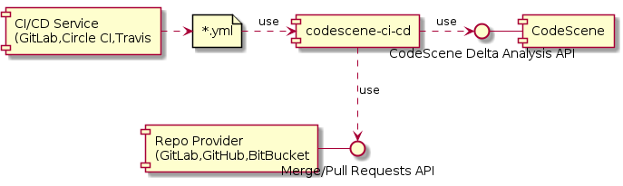
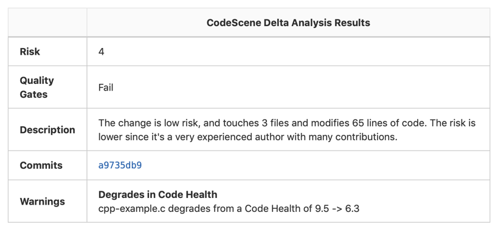
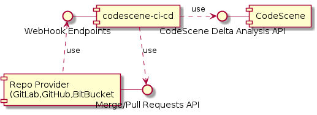

# codescene-ci-cd

[](https://travis-ci.com/empear-analytics/codescene-ci-cd)

A bridge application for integrating
[CodeScene](https://empear.com/how-it-works/) by Empear into CI/CD build pipelines


CodeScene identifies and prioritizes technical debt, while at the same time uncovering and measuring social factors of the organization behind
the system. The earlier you can react to any potential finding, the better. That’s why
CodeScene offers integration points that let you incorporate the analysis
results into your build pipeline.





The codescene-ci-cd application is runnable from build scripts in a CI-CD system, and uses the CodeScene Delta analysis API to perform a delta analysis and display the results in the build output. In addition to this, the analysis results can be attached as review comments on Merge/Pull Requests:



It is also possible to run codescene-ci-cd as a service that can respond to webhooks directly from the repo provider:




## Capabilities

This application lets you use CodeScene’s Delta Analysis to:
* Prioritize code reviews based on the risk of the commits.
* Specify quality gates for the goals specified on identified hotspots (see [Managing Technical Debt](https://empear.com/blog/manage-technical-debt-with-augmented-code-analysis/)).
* Specify quality gates that trigger in case the Code Health of a hotspot declines.

## Usage

### Run in CI/CD pipeline

The application can be run on its own in a repo folder with:

    $ java -jar codescene-ci-cd-1.0.0-standalone.jar [options]

With that said, the recommended usage in most build environments is to use the docker image available at [Docker Hub](https://hub.docker.com/r/empear/codescene-ci-cd) by configuring a build job using the image in the build file for a project.

Being a command line utility, _codescene-cd-cd_ takes numerous command line options specifying the delta analysis:

```
Usage: codescene-ci-cd [options]
Options:
    -h, --help
        --codescene-delta-analysis-url URL          CodeScene Delta Analysis URL
    -u, --codescene-user USER                       CodeScene User
    -p, --codescene-password PWD                    CodeScene Password
    -r, --codescene-repository REPO                 CodeScene Repository
        --analyze-individual-commits                Individual Commits
        --analyze-branch-diff                       By Branch
        --pass-on-failed-analysis                   Pass Build on Failed Analysis
        --fail-on-high-risk                         Fail Build on High Risk
        --fail-on-failed-goal                       Fail Build on Failed Goals
        --fail-on-declining-code-health             Fail Build on Code Health Decline
        --create-gitlab-note                        Create Note For Gitlab Merge Request
        --create-github-comment                     Create Comment For GitHub Pull Request
        --create-bitbucket-comment                  Create Comment For Bitbucket Pull Request
        --[no-]log-result                           Log the result (by printing)
        --coupling-threshold-percent THRESHOLD  75  Temporal Coupling Threshold (in percent)
        --risk-threshold THRESHOLD              9   Risk Threshold
        --previous-commit SHA                       Previous Commit Id
        --current-commit SHA                        Current Commit Id
        --base-revision SHA                         Base Revision Id
        --gitlab-api-url URL                        GitLab API URL
        --gitlab-api-token TOKEN                    GitLab API Token
        --gitlab-project-id ID                      GitLab Project ID
        --gitlab-merge-request-iid IID              GitLab Merge Request IID
        --github-api-url URL                        GitHub API URL
        --github-api-token TOKEN                    GitHub API Token
        --github-owner OWNER                        GitHub Repository Owner
        --github-repo REPO                          GitHub Repository Name
        --github-pull-request-id ID                 GitHub Pull Request ID
        --bitbucket-api-url URL                     BitBucket API URL
        --bitbucket-user USER                       BitBucket User
        --bitbucket-password PASSWORD               BitBucket Password
        --bitbucket-repo REPO                       BitBucket Repository Name
        --bitbucket-pull-request-id ID              BitBucket Pull Request ID
        --result-path FILENAME                      Path where JSON output is generated
        --http-timeout TIMEOUT-MS                   Timeout for http API calls
```
In a typical build environment, most of these options are common to all projects, and are thus best defined as variables set in the CI/CD-system, see examples below.

The `codescene-*` options specify how to connect to CodeScene and must match the settings in codescene itself. The `bitbucket-*`, `gitlab-*` and `github-*` options specify how to connect to the respective repo provider for creating comments on Merge/Pull Requests. See examples below for details. 

Flag options are used to enable analysis and gates in _codescene-ci-cd_ - by default nothing is enabled. 

The `result-path` saves the analysis results as a json file.

The `http-timeout` options specifies the timeout in milliseconds for all http requests. In some situations it may benecessary to specify a value greater than the default 10,000 ms.

#### Configure GitLab for CodeScene Delta Analysis

To enable the CodeScene integration in a GitLab build pipeline, jobs running _codescene-ci-cd_ are added to the projects _.gitlab-ci.yml_ file similar to the example provided  [here](templates/gitlab/.gitlab-ci.yml).

A good way to DRY up the _.gitlab-ci.yml_ files is by using GitLabs include/extends functionality to specify template jobs similar to [these](templates/gitlab/codescene-ci-cd.gitlab-ci.yml). In that case, the _.gitlab-ci.yml_ would only need a few lines for activating the delta analysis:

```
include: /templates/codescene-ci-cd.gitlab.yml

stages:
  - codescene-ci-cd

run-codescene-ci-cd-on-push:
  stage: codescene-ci-cd
  extends: .template-codescene-ci-cd-on-push

run-codescene-ci-cd-on-merge-request:
  stage: codescene-ci-cd
  extends: .template-codescene-ci-cd-on-merge-request
```

The `run-codescene-ci-cd-on-push` job runs analysis on individual commits for pushes. The `run-codescene-ci-cd-on-merge-request` job runs analysis on an entire branch for merge requests, and submits the results as a merge request comment.


In these examples, the `CI_*` variables are all built-in variables in GitLab. The `CODESCENE-*` variables are delta analysis specific variables that should be configured in the GitLab UI:

| Variable | Description |
| ------------- |-------------|
| CODESCENE_DELTA_ANALYSIS_URL | The full URL to the CodeScene Delta Analysis REST API. Retrievable from the CodeScene GUI. |
| CODESCENE_USER | A bot user created in codesene for accessing the API. |
| CODESCENE_PASSWORD | The password for the bot user. |
| CODESCENE_GITLAB_API_TOKEN | A personal access token created in GitLab. |
| CODESCENE_RISK_THRESHOLD | The risk threshold to use if _fail-on-high-risk_ is specified. (Optional) |
| CODESCENE_COUPLING_THRESHOLD_PERCENT | The coupling threshold used in the delta analysis. (Optional) |
| CODESCENE_TIMEOUT | The timeout in ms for all http calls in _codescene-ci-cd_. (Optional) |


To sum this up, the steps to follow for GitLab integration are:
1. Retrieve the delta analysis URL from the CodeScene UI.
1. Create a CodeScene bot user in the CodeScene UI.
1. Create a [Personal Access Token](https://docs.gitlab.com/ee/user/profile/personal_access_tokens.html) in GitLab that can be used for accessing the API, preferrably as a dedicated CodeScene user. (That user will be visible as the comment author.)
1. Add the `CODESCENE-*` variables specified in the table above as [custom variables](https://docs.gitlab.com/ee/ci/variables/#creating-a-custom-environment-variable)  through the GitLab UI.
1. Add delta analysis job(s) to _.gitlab-ci.yml_, preferrably using a template.

#### Configure Circle CI/GitHub for CodeScene Delta Analysis

To enable the CodeScene integration in a Circle CI build workflow, jobs running _codescene-ci-cd_ are added to the projects _.circleci/config.yml_ file similar to the example provided  [here](templates/circleci/config.yml).

The `codescene-ci-cd` job runs differently depending on whether it is a merge request build or not. For merge requests, it runs analysis on an entire branch and submits the results as a merge request comment. For regular commits, the individual commit is analysed

In these examples, the `CIRCLE_*` variables are built-in variables in Circle CI. The `CODESCENE-*` variables are delta analysis specific variables that should be configured in the Circle CI UI. In the examples a Circle CI [context](https://circleci.com/docs/2.0/contexts) is used for sharing these variables across projects.

| Variable | Description |
| ------------- |-------------|
| CODESCENE_DELTA_ANALYSIS_URL | The full URL to the [CodeScene Delta Analysis REST API](https://docs.enterprise.codescene.io/versions/3.2.3/guides/delta/automated-delta-analyses.html#the-rest-api-for-delta-analyses). Retrievable from the CodeScene GUI. |
| CODESCENE_USER | A bot user created in codesene for accessing the API. |
| CODESCENE_PASSWORD | The password for the bot user. |
| CODESCENE_RISK_THRESHOLD | The risk threshold to use if _fail-on-high-risk_ is specified. |
| CODESCENE_COUPLING_THRESHOLD_PERCENT | The coupling threshold used in the delta analysis. |
| CODESCENE_TIMEOUT | The timeout in ms for all http calls in _codescene-ci-cd_ |
| CODESCENE_GITHUB_API_URL | The full URL to the GitHub API. |
| CODESCENE_GITHUB_API_TOKEN | A personal access token created in GitHub. |


The steps to follow for Circle CI/GitHub integration are:
1. Retrieve the delta analysis URL from the CodeScene UI.
1. Create a CodeScene bot user in the CodeScene UI.
1. Create a [Personal Access Token](https://help.github.com/en/articles/creating-a-personal-access-token-for-the-command-line) in GitHub that can be used for accessing the API, preferrably as a dedicated CodeScene user. (That user will be visible as the comment author.)
1. Add the `CODESCENE-*` variables specified in the table above as custom variables through the Circle CI UI, preferrably [using a context](/https://circleci.com/docs/2.0/env-vars/#setting-an-environment-variable-in-a-context). 
1. Add delta analysis job(s) to _config.yml_.

Note that to DRY up the _config.yml_ the codescene-jobs one could optionally create a Circle CI [ORB](https://circleci.com/docs/2.0/creating-orbs/) containing the delta analysis jobs.

### Run as a service responding on webhooks

To start _codescene-ci-cd_ as a service, run it without any arguments. Configuration is done by setting some environment variables:

| Variable | Description |
| ------------- |-------------|
| CODESCENE_URL | The URL to the CodeScene instance used for delta analysis. |
| CODESCENE_USER | A bot user created in codesene for accessing the API. |
| CODESCENE_PASSWORD | The password for the bot user. |
| CODESCENE_CI_CD_GITHUB_SECRET | The secret set on the webhook in GitHub. |
| CODESCENE_CI_CD_GITHUB_TOKEN | A personal access token created in GitHub with permission to access and attach comments to commits and pull requests. |
| CODESCENE_CI_CD_AZURE_TOKEN | A personal access token created in Azure DevOps with permission to access and attach comment threads to pull requests. |
| CODESCENE_CI_CD_PORT | The port were the service is available. (default is 3005) |

Webhooks endpoints are provided on the following URL:s

| Repo service | Webhook Endpoint URL |
| ------------- |-------------|
| GitHub | [ServiceURL]/hooks/github |
| Azure DevOps | [ServiceURL]/hooks/azure
| GitLab | Not yet available. |
| BitBucket | Not yet available. |

#### Configure GitHub for CodeScene Delta Analysis
The steps to follow to configure GitHub using webhooks for triggering delta analysis are:

1. Create a CodeScene bot user in the CodeScene UI. Use the values specified for `CODESCENE_USER` and `CODESCENE_PASSWORD`
1. Create a [Personal Access Token](https://help.github.com/en/articles/creating-a-personal-access-token-for-the-command-line) in GitHub that can be used for accessing the API, preferrably as a dedicated CodeScene user. (That user will be visible as the comment author.) Use that value for `CODESCENE_CI_CD_GITHUB_TOKEN`.
1. Create a [webhook](https://developer.github.com/webhooks) on the repository you want to trigger an analysis for.
1. Copy the secret from the webhook and use as the value for `CODESCENE_CI_CD_GITHUB_SECRET`. 
1. Set the Payload URL for the webhook to `[ServiceURL]/hooks/github?project_id=[ProjectNbr]`. Retrieve the project number from the delta analysis URL from the CodeScene UI.
1. Select Push and Pull Request events to trigger the webhook.
1. Set the `CODESCENE_URL` and start the _codescene-ci-cd_ service.


#### Configure Azure DevOps for CodeScene Delta Analysis
The steps to follow to configure Azure using webhooks for triggering delta analysis are:

1. Create a CodeScene bot user in the CodeScene UI. Use the values specified for `CODESCENE_USER` and `CODESCENE_PASSWORD`
1. Create a [Personal Access Token](https://docs.microsoft.com/en-us/azure/devops/organizations/accounts/use-personal-access-tokens-to-authenticate?view=azure-devops#create-personal-access-tokens-to-authenticate-access) in Azure DevOps that can be used for accessing the API, preferrably as a dedicated CodeScene user. (That user will be visible as the comment author.) Use that value for `CODESCENE_CI_CD_AZURE_TOKEN`.
1. Create a [webhook](https://docs.microsoft.com/en-us/azure/devops/service-hooks/services/webhooks?view=azure-devops) on the project with the repository you want to trigger an analysis for.
1. Set the webhook to trigger on `pull request updated` events with change filter `source branch changed`.
1. Copy the secret from the webhook and use as the value for `CODESCENE_CI_CD_GITHUB_SECRET`. 
1. Set the URL for the webhook to `[ServiceURL]/hooks/azure?project_id=[ProjectNbr]`. Retrieve the project number from the delta analysis URL from the CodeScene UI.
1. Create another webhook for `pull request created` events with the same settings.
1. Set the `CODESCENE_URL` and start the _codescene-ci-cd_ service.


## Manual build

You can build the latest version of _codescene-ci-cd_ by running `lein uberjar`. The corresponding docker image is then built using `docker build -t empear/codescene-ci-cd . `.
Run _codescene-ci-cd_ inside the docker image using `docker run -it empear/codescene-ci-cd [options]`

## Releasing

A release build is automatically triggered when pushing a release tag to a repository.
The corresponding docker image is manually built and pushed to docker hub.

## Contributing

You're encouraged to submit [pull
requests](https://github.com/empear-analytics/codescene-ci-cd/pulls),
and to [propose features and discuss
issues](https://github.com/empear-analytics/codescene-ci-cd/issues).

## License

Licensed under the [MIT License](LICENSE).
